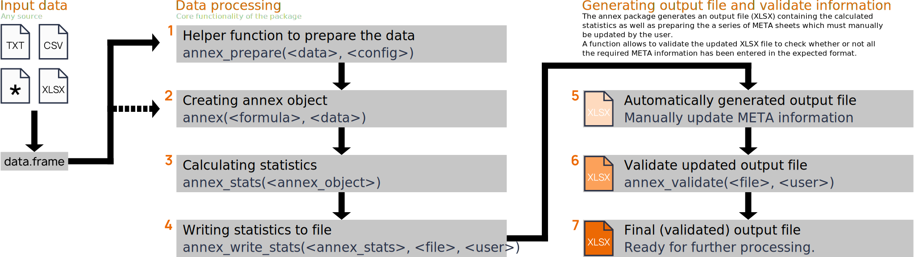

# `annex`; Annex86 Data Analysis Package

<!---->

## Installation

The R package `annex` provides a series of functions and methods to easily
process measurement data for the IEA EBC Annex86 project, as well as writing
(and validating) the final file intended to be used to build a data repository
for research in the field related to the project.

**Install via remotes**

The package is currently hosted on github and can be installed via
the [`remotes`](https://cran.r-project.org/package=remotes) package by
calling `remotes::install_github()` from within an active R session. Note
that you may need to install the remotes package first.

```
library('remotes')
install_github("IEA-EBC-Annex86/annex")
```

**Dependencies**

The `annex` package available via this repository has a few dependencies
required to process the data. R should automatically resolve backwards
dependencies on installation. For more information, have a look at the
[DESCRIPTION](https://github.com/IEA-EBC-Annex86/annex/blob/main/DESCRIPTION)
file on github.com.


## Overview

The figure below shows a schematic of the process on how to use the `annex`
package to process measurements as well as create and validate the final
standardized output file.



At first, the user needs to import the required data sets himself/herself.
The `annex` package does not provide functionality as the data come in various
different formats, however, the [documentation](https://iea-ebc-annex86.github.io/annex/)
provides some examples in case the data is available as in the XLSX format
or as tabular text files
(see [Analysis from XLSX](https://iea-ebc-annex86.github.io/annex/articles/from_xlsx.html) or
[Analysis from textfiles](https://iea-ebc-annex86.github.io/annex/articles/from_textfiles.html)),
but the package is not limited to this. All needed is to provide the data as proper
R [`data.frames`](https://discdown.org/rprogramming/dataframes.html) for further processing.

1. The function `annex_prepare()` is a helper function to prepare the measurement data set
    for further processing steps (can be bypassed if needed).
2. `annex()` is the creator function for annex objects. It defines what to process and
    performs a series of checks.
3. `annex_stats()` takes up the `annex` object from the previous step to calculate the
    statistics (aggregated statistical mesures); returns a `annex_stats` object.
4. The object from the previous step can then be written into the final XLSX file.
5. The result is an XLSX file containing the statistics as well as pre-filled sheets
    for the required meta information. This information has to be filled in manually
    by the user.
6. `annex_validate()` can be used to check if all meta information has been filled in
    properly or if further manual interaction by the user is required.
7. Once the validation is happy with the XLSX file, the analysis is completed and
    the final analysis can e.g., be submitted to an upcoming research repository or
    used for further analysis.

## Documentation

Documentation and examples are available on [github.io](https://iea-ebc-annex86.github.io/annex/)

* <https://iea-ebc-annex86.github.io/annex/>

The documentation contains a series of articles which explain how to use the `annex` package
as well as some additional information regarding package functionality.

